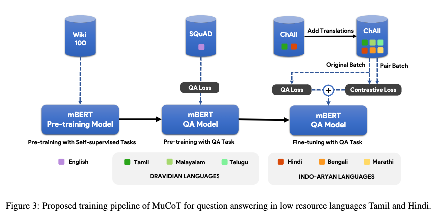
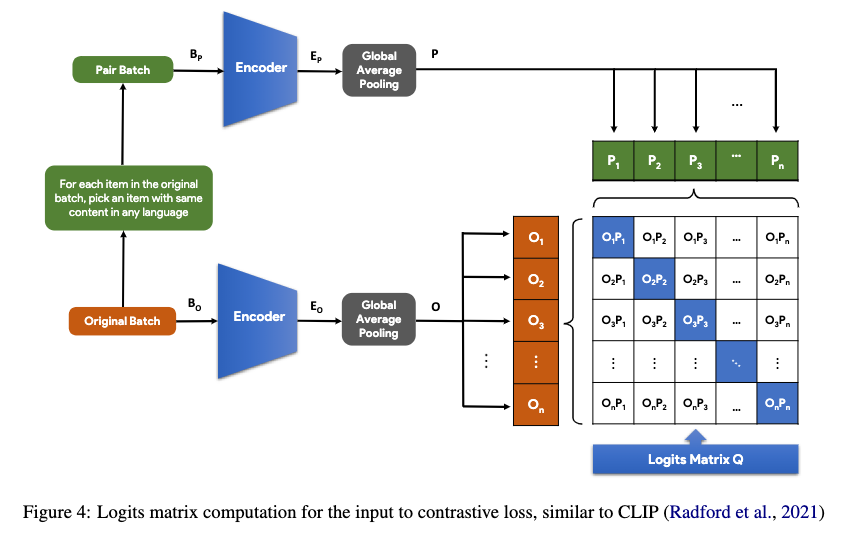
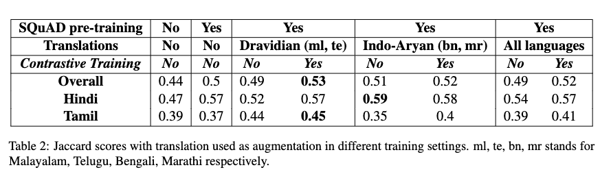
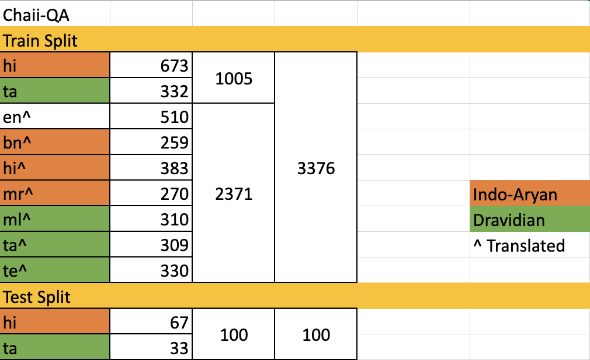

# MuCoT: Multilingual Contrastive Training for Question-Answering in Low-resource Languages

> 🎉 Accepted for oral presentation at [#ACL 2022](https://www.2022.aclweb.org/) [Workshop on Speech and Language Technologies for Dravidian Languages](https://dravidianlangtech.github.io/2022/)

Accuracy of English-language Question Answering (QA) systems has improved significantly in recent years with the advent of Transformer-based models (e.g., BERT). These models are pre-trained in a self-supervised fashion with a large English text corpus and further fine-tuned with a massive English QA dataset (e.g., SQuAD). However, QA datasets on such a scale are not available for most of the other languages. Multi-lingual BERT-based models (mBERT) are often used to transfer knowledge from high-resource languages to low-resource languages. Since these models are pre-trained with huge text corpora containing multiple languages, they typically learn language-agnostic embeddings for tokens from different languages. However, directly training an mBERT-based QA system for low-resource languages is challenging due to the paucity of training data. In this work, we augment the QA samples of the target language using translation and transliteration into other languages and use the augmented data to fine-tune an mBERT-based QA model, which is already pre-trained in English. Experiments on the Google ChAII dataset show that fine-tuning the mBERT model with translations from the same language family boosts the question-answering performance, whereas the performance degrades in the case of cross-language families. We further show that introducing a contrastive loss between the translated question-context feature pairs during the fine-tuning process, prevents such degradation with cross-lingual family translations and leads to marginal improvement. The code for this work is available at https://github.com/gokulkarthik/mucot.

**TL;DR:** We use contrastive loss between the translated pairs during fine-tuning to improve multilingual BERT for question answering in low-resource languages.

**[[ArXiv Preprint](https://arxiv.org/abs/2204.05814)] [[ACL 2022 Slides](https://github.com/gokulkarthik/mucot/blob/main/images/mucot-acl.pdf)]**

**Bibtex**:
```
@inproceedings{
kumar2022mucot,
title={MuCoT: Multilingual Contrastive Training for Question-Answering in Low-resource Languages},
author={Kumar, Gokul Karthik and Gehlot, Abhishek Singh and Mullappilly, Sahal Shaji and Nandakumar, Karthik},
booktitle={The Second Workshop on Speech and Language Technologies for Dravidian Languages-ACL 2022},
year={2022}
}
```
---

# Index
- [Idea](#idea)
- [Results](#results)
- [Datasets](#datasets)
- [Models](#models)

---
<br>

# Idea




# Results


## Datasets

### Chaii

<!-- * Chaii Original - [Kaggle Link](https://www.kaggle.com/c/chaii-hindi-and-tamil-question-answering/data)
    * Chaii Translated & Transliterated - [Kaggle Link](https://www.kaggle.com/gokulkarthik/chaiitrans) -->
<ul>
    <li>
        Chaii Original -
        <a href="https://www.kaggle.com/c/chaii-hindi-and-tamil-question-answering/data">
            
        </a>
    </li>
    <li>
        Chaii Translated & Transliterated -
            <a href="https://www.kaggle.com/gokulkarthik/chaiitrans">
            
        </a>
    </li>
</ul>

> Run [`data/chaii_split.py`](./data/chaii_split.py) from the root directory make the train-val-test splits.


## Models

### Pretrained:
- [mBERT](https://huggingface.co/bert-base-multilingual-cased) | [mBERT SQUAD](https://huggingface.co/salti/bert-base-multilingual-cased-finetuned-squad)

